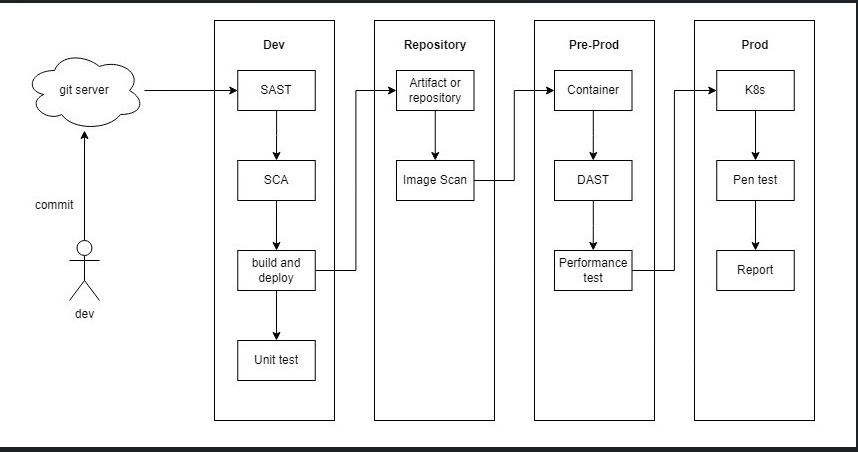

# GitLab CI/CD Pipeline Configuration
This repository includes two GitLab CI/CD configuration files:

    + gitlab-ci-be.yml: Defines the pipeline for backend services.
    + gitlab-ci-fe.yml: Defines the pipeline for frontend services.

Below is a detailed breakdown of the stages and scripts in each file.

## Tech Stack

**Client:** React

**Server:** .NET

**Tools:** Docker, Snyk, Codeclimate, Trivy, K6, Arachni, Gitlab CI/CD

## Workflow

## .gitlab-ci-be.yml - Backend CI/CD Pipeline
1. Variables
The following environment variables are defined for the backend CI pipeline:
- USER_PROJECT: Project name (default: "onlineshop").
- IMAGE_VERSION: Docker image version combining project name, branch, and commit hash.
- CODECLIMATE_REPORT: Path for CodeClimate analysis report.
- SNYKSCAN_REPORT: Path for Snyk scan report.
- TRIVYFS_REPORT: Path for Trivy file system scan report.
- TRIVY_IMAGE_REPORT: Path for Trivy Docker image security scan report.

2. Stages
    - build: Builds the Docker image for the backend.
    - test source code: Runs static code analysis and security  scans on the backend code.
    - security scan image: Scans the built Docker image for security vulnerabilities.
    - push: Pushes the Docker image to the registry.
    - deploy: Deploys the backend Docker image to the target environment.

3. Job Descriptions
- build:
    + Clones the repository and builds the Docker image.
    + Runs on the online-shop-runner-build-shell runner.
- codeclimate analyze:
    + Runs CodeClimate to analyze the source code and generate an HTML report.
    + Artifacts are stored for one day.
- trivyfs scan:
    + Runs Trivy to scan the file system for vulnerabilities with high and critical severity.
    + Outputs an HTML report saved as an artifact.
- snyk scan:
    + Runs a Snyk scan to identify security vulnerabilities in the codebase.
- trivy scan image:
    + Scans the Docker image for vulnerabilities using Trivy and generates an HTML report.
- push:
    + Pushes the built Docker image to the Docker registry.
- deploy:
    + Pulls the Docker image and deploys it, replacing the current running instance.
## .gitlab-ci-fe.yml - Frontend CI/CD Pipeline
1. Variables
The following environment variables are defined for the backend CI pipeline:
- USER_PROJECT: Project name (default: "onlineshop").
- IMAGE_VERSION: Docker image version combining project name, branch, and commit hash.
- CODECLIMATE_REPORT: Path for CodeClimate analysis report.
- SNYKSCAN_REPORT: Path for Snyk scan report.
- TRIVYFS_REPORT: Path for Trivy file system scan report.
- TRIVY_IMAGE_REPORT: Path for Trivy Docker image security scan report.
- ARACHNI_WEBSITE_REPORT: Path for Arachni website security scan report.
- K6_PERFORMACE_TEST_REPORT: Path for K6 performance testing report.

2. Stages
    - build: Builds the Docker image for the backend.
    - test source code: Runs static code analysis and security  scans on the backend code.
    - security scan image: Scans the built Docker image for security vulnerabilities.
    - push: Pushes the Docker image to the registry.
    - deploy: Deploys the backend Docker image to the target environment.
    - security scan website: Scans the deployed website for security vulnerabilities.
    - performace testing: Runs performance testing using K6.

3. Job Descriptions
- build:
    + Clones the repository and builds the Docker image.
    + Runs on the online-shop-runner-build-shell runner.
- codeclimate analyze:
    + Runs CodeClimate to analyze the source code and generate an HTML report.
    + Artifacts are stored for one day.
- trivyfs scan:
    + Runs Trivy to scan the file system for vulnerabilities with high and critical severity.
    + Outputs an HTML report saved as an artifact.
- snyk scan:
    + Runs a Snyk scan to identify security vulnerabilities in the codebase.
- trivy scan image:
    + Scans the Docker image for vulnerabilities using Trivy and generates an HTML report.
- push:
    + Pushes the built Docker image to the Docker registry.
- deploy:
    + Pulls the Docker image and deploys it, replacing the current running instance.
- security scan website:
    + Uses Arachni to scan the frontend website for security vulnerabilities and generates a report.
- performace testing:
    + Executes performance testing using K6 on the frontend.
## Authors

- an.phamky1234@gmail.com

